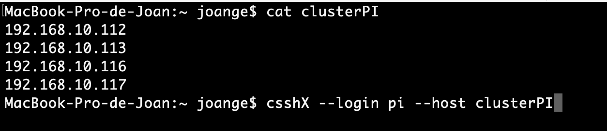
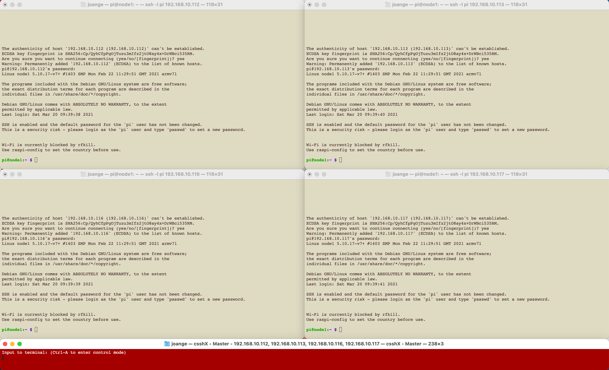
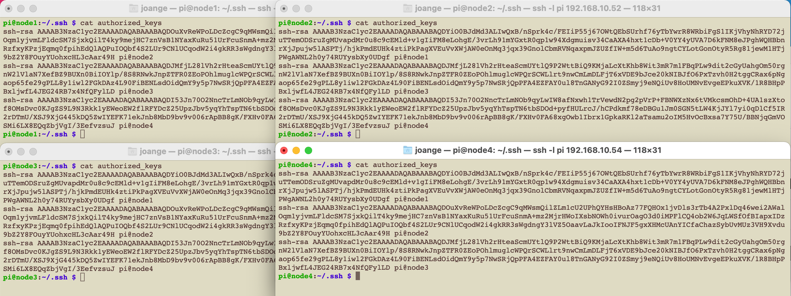
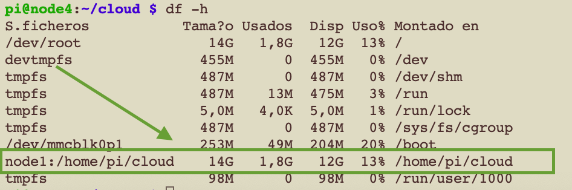

<style>
img[alt~="center"] {
  display: block;
  margin: 0 auto;
}
</style>

<!-- _class: centrar -->
<!-- backgroundColor: #EBF5FB -->

# Computació Paral·lela amb un clúster de Raspberry Pi. Programació amb `Python` i `MPI`. 
# Joan Gerard Camarena Estruch.

---
# Elements necessaris

## Hardware
- 4 raspberry Pi amb alimentador
- 4 microSD
- 1 Switch
- 1 rack per a Raspberry

## Software:
- MPI (Message Passing Interface)
- Python
- ssh 

---

# Pla de treball
1. Acoblament del clúster
2. Instal·lar i configurar la imatge bàsica (_master_)
3. Copia i configuració de la resta d'imatges (_nodes_)
4. Configuració del clúster. Carpetes en xarxa. `ssh` i `clusterssh`
5. MPI (Message Passing Interface) Teoria i fonaments
6. Proves de programació distribuida
---
# Acoblament del cluster

Teniu com a material:
- 4 rapsberrys Pi
- 4 carregadors 
- 4 microSD
- 5 cables RJ45
- 1 PC 
- 1 rack
- 1 switc

Seguint les instruccions, atornillarem les plaquetes al rack i l'ensamblarem. 
També hauriem de cablejar les raspberrys al switch

---
# Imatge (1)

Descarregarem la imatge del sistema operatiu de la raspberry. 

Donat que ho configurarem tot per `ssh` i la terminal, no necessitarem cap escriptori. També aconseguim un menor consum de recursos.

La versió més actual és:
<https://downloads.raspberrypi.org/raspios_lite_arm64/images/raspios_lite_arm64-2023-02-22/2023-02-21-raspios-bullseye-arm64-lite.img.xz>

> Nosaltres farem servir la verió de gener del 21, per millorar la compatibilitat.

---

# Imatge (2)

El fitxer `img` resultant el tenim que escriure a una targeta microSD. Per a fer-ho podem fer servir distints programes:

- [Windows] → `Win32ImageWriter`, disponible en <https://launchpad.net/win32-image-writer>
- [Ubuntu] → `usb-imagewriter`, dispoible als repositoris d'ubuntu
- Alternativa multiplataforma i recomanada `balenaEtcher` <https://www.balena.io/etcher/> (sols grava a sd)


---

# Imatge (3)

Des de la consola en sistemes **Linux/Mac**, tant per gravar com per clonar:

1. Executar `sudo fdisk -l` i fixar-se dels discs que tenim al nostre sistema. En mac `diskutil list`
2. Inserir la microSD directament o amb algun acoplador. Es recomana a un port USB 3.
3. Tornem a executar `sudo fdisk -l`. Fixar-se en el tamnay (8 o 16GB). Serà algun disk que no teniem al pas 1. Suposarem que s'ha muntat en `/dev/sdx`. 
4. En cas que linux l'haja muntada en algun lloc, haurem de desmuntar-la `sudo umount /dev/sdx`. Pot-ser bote algun error que el disc no està muntat; no passa res, és el que voliem
5. I finalment, a la carpeta on tenim el fitxer: (`if` i `of` són input/output file)
```
sudo dd bs=16M if=arxiu.img of=/dev/sdx
```

---

# Configuració comuna(1)

Totes les raspberrys que formen part del clúster han de tindre una configuració comuna:
1. Arrancar una raspberry (la 1) amb monitor i teclat connectat. Tindrà xarxa per DHCP.
2. `sudo apt update` , `sudo apt upgrade`
3. Executem `sudo raspi-config` i passar per les següents parts:
   1. Menú `1 System Options`:
    - `S4 Hostname` → `node1`
    - `S5 Boot/Autologin` → triar opció `B2 Console Autologin`
  2. Menú `2 Display Option`: Ací no tocarem res
  3. Menú `3 Interface Options`:
     - `P2 SSH` i habilitarem el login remot i el servidor SSH
  4. Menú `4 Performance Options`:
     1. `P2 GPU Memory` i en deixem sols 16MB. Pensa que sols entrarem en la consola
---

# Configuració comuna (2)

  5. Menú `5 Localization`:
     1. `L1 Locale`: llevarem `en_GB.UTF8` i posarem el `es_ES.ETUF-8`
     2. `L2 Timezone`: posarem Europe -> Madrid
     3. `L3 Keyboard`: seleccionarem Spanish
  6. Menú `6 Advanced Options`:
     1. `A1 Expand Filesystem` -> per ocupar tota la sd
     2. `A4 Network Interface Names` -> seleccionem `no`. Per tenir eth0 en compte de `enxb827eb9f90a4` (unac combinació del literal `enx` seguit de la MAC de la interfícies) 
  7. Menú `8 Update` no cal res, ja que hem fet el `update-upgrade` abans
  8. Menú `9 About` no cal res
4. `sudo reboot` 

---

# Configuració comuna. Instalar MPI (1)

1. `mkdir mpich3` La carpeta que contindrà l'instalador
2. `cd mpich3` Entrem i descarreguem la versió
3. `wget http://www.mpich.org/static/downloads/3.3.2/mpich-3.3.2.tar.gz`
4. Descomprimim: `tar xfz mpich-3.3.2.tar.gz` 
5.  `sudo mkdir /home/rpimpi`
6.  `sudo mkdir /home/rpimpi/mpi-install`
7.  `sudo mkdir /home/pi/mpi-build`
8.  `cd /home/pi/mpi-build`
9.  `sudo apt-get install gfortran`

---

# Configuració comuna. Instalar MPI (2)

Compilem MPI per a la plataforma. Aquest procés pot durar fins 1 hora

1.  `sudo /home/pi/mpich3/mpich-3.2.2/configure -prefix=/home/rpimpi/mpi-install`
2.  `sudo make` → compilem
3.  `sudo make install`  → instalem
4.  afegim mpi al path: `nano .bashrc` en l'ultima linia `PATH=$PATH:/home/rpimpi/mpi-install/bin`
5.  reiniciar → `sudo reboot`
6.  Comprovar que mpi funciona: `mpiexec -n 1 hostname`

---

# Configuració comuna. Instalar MPI (3)
 
Instalem les llibreries de per a programar en Pytohn

1.  Instal·lar les llibreries extra de python `sudo apt install python-dev`
2.  Instal·lar el gestor de llibreries → `sudo apt install python-pip`
3.  Instal·lar mpi4py → `pip install mpi4py`
4.  Provem que funciona → `mpiexec -n 4 python helloworld.py`

```python
# -*- coding: utf-8 -*-
from mpi4py import MPI
import sys

size=MPI.COMM_WORLD.Get_size()
rank=MPI.COMM_WORLD.Get_rank()
name=MPI.Get_processor_name()

print("Hello world, Soc el procés %2d de %2d al node %10s" %(rank,size,name))
```
---

# Clonació de la targeta SD.

En aquets apartat el que haurem de fer és :

1. Apagar la Raspberry
2. Fer un fitxer **img** a partir de la microSD.
3. A partir del nou img gravar les altres 3 targetes.

Es subministra un fitxer img creat amb tota la instal·lació ja creada. Per tant la primera part de configuració **no caldrà fer-la**.

> En aquest moments és com si tinguerem 4 màquines idèntiques. Haurem de fer alguna cosa per fer-les disitntes

---

# Configuración de cada node per separat

Hem de configurar en cada node:

1. Adreça estàtica
2. Hostname
3. Crear clau *ssh*
4. Transferir la clau entre tots els nodes
5. Muntar una carpeta compartida amb *nfs*

>Notes:
> - Necessitarem un _sniffer_ de la xarxa per descobrir quines IP's tenen. Es recomana <https://angryip.org>.
> - Per treballar amb totes les màquines alhora, podem fer servir alguna implementació de _cluster-ssh_

---

# Configuración de cada node (1)

Descobrir quines adreces IP tenen cadascun dels nodes.


---

# Configuración de cada node (2)

Amb alguna ferramenta com cluster-ssh ens connectem a elles


- Hem de crear un fitxer de text amb les IP's que hem trobat anteriorment (`clusterPI` a l'exemple)
- Haurem de escrure un `yes` per acceptar el _fingerprint_
- Escriure el password `raspberry`

---

# Configuración de cada node (3)



---

# Configuración de cada node (4)

Adreça estàtica - `/etc/network/interafaces`

```bash
# source-directory /etc/network/interfaces.d

auto eth0
#iface eth0 inet dhcp
iface eth0 inet static
address 192.168.10.5x
netmask 255.255.255.0
gateway 192.168.10.1
```
> Notes:
> - La primera linia la comentarem, així com afegirem una comentada per dhcp
> - la `x` serà del 1..4. Desprès segons el valor de x li donarem nom al hostame
> - canviar `192.168.10` per la xarxa de l'aula adequada
> - **Atenció**: com muntarem dos clústers, un que comencé en la 50 i altre en la 60.

---

# Configuración de cada node (5)

## Nom del host - `/etc/hostname`

Per a identificar cada màquina dins de cada clúster i en tota l'aula, li posarem com a nom `node_X_Y` on:
-  `X` serà el número de clúster
-  `Y` serà el número de node dins del clúster. 

Dins de cada fitxer `/etc/hostname` contindrà el seu nom de host.
```
192.168.10.51  ←→ node_1_1
192.168.10.52  ←→ node_1_2
192.168.10.53  ←→ node_1_3
192.168.10.54  ←→ node_1_4
```
---

# Configuración de cada node (6)

## Equips del clúster - `/etc/hosts`

Aquest fitxer conté el llistat de tots els nodes del clúster, amb el seu nom i la seua IP. Això ens servirà per fer servir noms en compte d'adreces IP.

```
127.0.0.1       localhost
::1             localhost ip6-localhost ip6-loopback
ff02::1         ip6-allnodes
ff02::2         ip6-allrouters

192.168.10.51   node_1_1
192.168.10.52   node_1_2
192.168.10.53   node_1_3
192.168.10.54   node_1_4
```

Reiniciar tot el cluster i fer proves de `ping`. Hauras de netejar el teu fitxer de hoss conegut del ordinador des d'on ens connectem,  ja que hem canviat la IP `~/.ssh/known_hosts` 

---

# Primera prova d'execució (1)

Anem a treballar sols amb el `node1`

1. Crec carpeta mpi_test: `mkdir mpi_test`
2. Moure o crear amb editor nano el programa d'abans: `mv helloworldmpi.py mpi_test/`
3. Entrem i crear el següent `machinefile`. Aquest fitxer conte una linia per cada node del cluster, amb la sintaxi `node[:cores]`

```
node_1_1:4
node_1_2:4
node_1_3:4
node_1_4:4
```

> El numeret desprès dels dos punts indica els nuclis d'execució que supporta cada node.
---

# Primera prova d'execució (2)

```
pi@node1:~/mpi_test $ mpiexec -f machinefile -n 4 python helloworldmpi.py 
Hello world, I'm process 0 of 4 in processor node_1_1
Hello world, I'm process 1 of 4 in processor node_1_1
Hello world, I'm process 2 of 4 in processor node_1_1
Hello world, I'm process 3 of 4 in processor node_1_1
```
Tot be, ja que cada node té 4 cores, i s'executa tot en el `node1`. Però que passa si fem:

```
pi@node1:~/mpi_test $ mpiexec -f machinefile -n 16 python helloworldmpi.py 
Host key verification failed.
Host key verification failed.
Host key verification failed.
```

Falla. No tenim accès a la resta de nodes a mitjançant la xarxa. MPI es comunica per `ssh`. Anem a solucionar-ho.

---

# Configuración de cada node (7)

1. Hem d'aconseguir poder fer login automàticament desde qualssevol node a qualssevol altre node. 
2. Per aixó farem en `node_1_x (x=1..4)`
```
# generem les claus SSH
ssh-keygen                  # acceptar tot per defecte
cd ~/-.ssh
cp id_rsa.pub node_1_x_key    # x=1..4
```

Exportem en tots els nodes les claus dels altres tres. Exemple de importació de la clau de `node_1_1` als altres tres:

```
scp node_1_1:/home/pi/.ssh/node_1_1_key .     # vigila el últim .
cat node_1_1_key>>authorized_keys
```
El comandament transfereix la clau pública del node 1 a la màquina des d'on ho hem executat.

---

# Configuración de cada node (8)



En `authorized_keys` tenim les claus ssh dels altres tres nodes. Ja podem entrar (login) sense problema

---

# Primera prova d'execució (3)

Tornem al prova, des del `node_1_1`

```
pi@node1:~/mpi_test $ mpiexec -f machinefile -n 16 python helloworldmpi.py 
[proxy:0:3@node_1_4] launch_procs ... /home/pi/mpi_test (No such file or directory)
```
***Altre Error !!!*** El que indica el següent missatge és que quan estavem en `node_1_4` (o altre node del clúster), ha intentat entrar en la carpeta `/home/pi/mpi_test` i no la troba.

**Problema** → El codi font ha d'estar en la mateixa ruta en tots els nodes
#### Possibles solucions:
  - Cada cop que editem el codi, l'haurem de copiar en totes els nodes. Implica copiar-ho per a cada modificació
  - Creem una carpeta en xarxa, compartida per tots els nodes per NFS. **Aquesta és la bona** :+1:

---

# Configuración de cada node (9)

La manera de treball serà:

**node_1_1**:
- Executarà un servidor de `nfs`, i exportarem (compartirem) una carpeta per xarxa
- Com a programadors treballarem exclusivament en aquest node.
 
**resta de nodes**:
- Monterem durant l'arranc la carpeta en xarxa que existeix en `node_1_1`
- Estaran en funcionament, però no treballarema amb ells. Seràn invocats per `node_1_1` al moment d'executar algun programa. 

---

# Configuración de cada node (10)

## Instalar servidor nfs i compartir carpeta - (en node_1_1) 

- `sudo apt install nfs-kernel-server`
- `mkdir /home/pi/cloud`
- `sudo nano /etc/exports` i afegir  la següent linia
```
/home/pi/cloud *(rw,sync,no_root_squash,no_subtree_check)
```
- `sudo chmod -R 777 /home/pi/cloud`
- `sudo update-rc.d rpcbind enable`
- `sudo service rpcbind restart`
- `sudo exportfs -a`
- `sudo service nfs-kernel-server restart`

---

# Configuración de cada node (11)

## Instalar client nfs i montar carpeta - (en `node_1_x, x=2,3,4`) 

- `sudo mkdir /home/pi/cloud`
- `sudo /etc/fstab` i afegir la linia: 
```
node1:/home/pi/cloud /home/pi/cloud  nfs auto,noatime,nolock,bg,nfsvers=4,intr,actimeo=1800 0 0`
```
- Reiniciem en tots els `node_1_x` per comprovar que ho automonta


<https://manpages.ubuntu.com/manpages/xenial/es/man5/nfs.5.html>


---

# Primera prova d'execució (4)

- En `node_1_1` movem el programa `helloworldmpi.py` i el `machinefile` de `mpi_test` a `cloud`, que serà ja la carpeta de treball.
```
pi@node1:~/cloud $ mpiexec -f machinefile -n 16 python helloworldmpi.py 
Hello world, Soc el procés  0 de 16 a      node1
Hello world, Soc el procés  8 de 16 a      node3
Hello world, Soc el procés 12 de 16 a      node4
Hello world, Soc el procés  4 de 16 a      node2
Hello world, Soc el procés  1 de 16 a      node1
Hello world, Soc el procés  9 de 16 a      node3
Hello world, Soc el procés 13 de 16 a      node4
Hello world, Soc el procés  5 de 16 a      node2
Hello world, Soc el procés  2 de 16 a      node1
Hello world, Soc el procés 10 de 16 a      node3
Hello world, Soc el procés 14 de 16 a      node4
Hello world, Soc el procés  6 de 16 a      node2
Hello world, Soc el procés  3 de 16 a      node1
Hello world, Soc el procés 11 de 16 a      node3
Hello world, Soc el procés 15 de 16 a      node4
Hello world, Soc el procés  7 de 16 a      node2
```
---

# Primera prova d'execució (i 5)

Observem que:

- S'han executat 4 tasques en cada node, gràcies a la configuració del `machinefile` (recordes `node_1_1:4`?)
- El funcionament és anàrquic: molts processos fent coses alhora, i no hi ha control del que ix alhora 
- Fes distintes proves en múltiples de 4

# Fi de la primera part

---

<!-- _class: centrar -->

# Fi de la primera part
# Tornem i a programar...