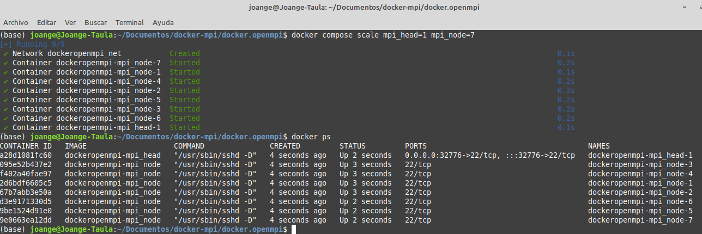
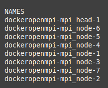

# Programació pararl·lela amb MPI amb un cluster de contenidors

En el taller de programació paral·lela has vist com treballar en un cluster de màquines reals. Per qüestions de logística les hem creat amb un cluster de raspberrys

# Clúster de contenidors

La primera tasca consisteix en crear un cluster de contenidors. Anem a basar-nos i explicar el contingut d'un ja fet, el `docker.openmpi`

Al final disposarem de `n` nodes d'execució, tots idèntics. De tots ells un serà el que ens farà de master i altres d'esclaus. Les imatges per a aquests contenidors s'han creat amb aquest `dockerfile`, que expliquem entre els comentaris
```dockerfile
# Ens basem ambuna ubuntu 18
FROM ubuntu:18.04

# ------------------------------------------------------------
# Alguines variables d'entorn
# ------------------------------------------------------------

# L'usuari dels nodes
ENV USER mpirun

# Diguem que la instalació siga desatesa (no interactiva)
ENV DEBIAN_FRONTEND=noninteractive 

#Creem el home de l'usuari
ENV HOME=/home/${USER} 

# Instal·lem tot el necessari
RUN apt-get update -y && \
    apt-get install -y --no-install-recommends sudo apt-utils && \
    apt-get install -y --no-install-recommends openssh-server \
        python-dev python-numpy python-pip python-virtualenv python-scipy \
        gcc gfortran libopenmpi-dev openmpi-bin openmpi-common openmpi-doc binutils && \
    apt-get install -y --no-install-recommends nano && \
    apt-get install -y --no-install-recommends git && \
    apt-get install -y --no-install-recommends inetutils-ping && \
    apt-get clean && apt-get purge && rm -rf /var/lib/apt/lists/* /tmp/* /var/tmp/*

# ------------------------------------------------------------
# Crea un directori anomenat sshd a la ruta /var/run/. 
# Aquest directori s'utilitza per emmagatzemar informació en temps 
# d'execució per al servidor SSH
# ------------------------------------------------------------
RUN mkdir /var/run/sshd

# ------------------------------------------------------------
# Establim el password de root com l'usuari 
# ------------------------------------------------------------
RUN echo 'root:${USER}' | chpasswd

# ------------------------------------------------------------
# Aquesta comanda modifica el fitxer de configuració del servidor SSH, sshd_config. 
# Permetent l'inici de sessió com a root sense contrasenya. 
# Canvia PermitRootLogin without-password per PermitRootLogin yes
# ------------------------------------------------------------
RUN sed -i 's/PermitRootLogin without-password/PermitRootLogin yes/' /etc/ssh/sshd_config


# ------------------------------------------------------------
# Fixa el login SSH login fix. Per no expulsar l'usuari desprès del login
# ------------------------------------------------------------
RUN sed 's@session\s*required\s*pam_loginuid.so@session optional pam_loginuid.so@g' -i /etc/pam.d/sshd

# ------------------------------------------------------------
# Configuracions adicionals
# ------------------------------------------------------------
ENV NOTVISIBLE "in users profile"
RUN echo "export VISIBLE=now" >> /etc/profile

# ------------------------------------------------------------
# Afegim l'usuari  'mpirun'
#       sense password
#       amb privilegis de sudo
# ------------------------------------------------------------

RUN adduser --disabled-password --gecos "" ${USER} && \
    echo "${USER} ALL=(ALL) NOPASSWD:ALL" >> /etc/sudoers

# ------------------------------------------------------------
# Set-Up SSH with our Github deploy key (original)
# ------------------------------------------------------------


# ------------------------------------------------------------
# Creem el directori del ssh server
# ------------------------------------------------------------

ENV SSHDIR ${HOME}/.ssh/
RUN mkdir -p ${SSHDIR}

# ------------------------------------------------------------
# Copiem les claus públiques i privades originals
# Ademés afegim la publica com a authorized keys
# Per poder fer login automàtic
# ------------------------------------------------------------
ADD ssh/config ${SSHDIR}/config
ADD ssh/id_rsa.mpi ${SSHDIR}/id_rsa
ADD ssh/id_rsa.mpi.pub ${SSHDIR}/id_rsa.pub
ADD ssh/id_rsa.mpi.pub ${SSHDIR}/authorized_keys

RUN chmod -R 600 ${SSHDIR}* && \
    chown -R ${USER}:${USER} ${SSHDIR}


# ------------------------------------------------------------
# Actualitzem el pip
# ------------------------------------------------------------
RUN pip install --upgrade pip


# ------------------------------------------------------------
# Instal·lem mpi4py
# ------------------------------------------------------------
USER ${USER}
RUN  pip install --user -U setuptools \
    && pip install --user mpi4py

# ------------------------------------------------------------
# Configurem OpenMPI
# ------------------------------------------------------------

USER root

RUN rm -fr ${HOME}/.openmpi && mkdir -p ${HOME}/.openmpi
ADD default-mca-params.conf ${HOME}/.openmpi/mca-params.conf
RUN chown -R ${USER}:${USER} ${HOME}/.openmpi


# ------------------------------------------------------------
# Clonem el repo del taller
# ------------------------------------------------------------
WORKDIR ${HOME}
RUN git clone https://github.com/joange/TallerRaspberry.git


# Exposem el port 22 i arranquem el servidor ssh
EXPOSE 22
CMD ["/usr/sbin/sshd", "-D"]

```

A continuació anem a detallar els serveis que es desplegaran, tot això mitjançant un `docker-compose`:

```yaml
version: "3"

services:
  mpi_head:
    build: .
    ports: 
      - "22"
    links: 
      - mpi_node
    networks:
      - net

  mpi_node:
    build: .
    networks:
      - net

networks:
  net:
    driver: bridge
```

Com pot veur-se es crea: 

1. Una xarxa que ens permet pontejar la màquina amfitriona amb els contenidors
2. Un node `mpi_node`, que farà les funcions de treballador o esclau.
3. Un node `mpi_head`, que farà les funcions de coordinador o master. Fixa't que exposa el port 22 per a connectar-se desde fora

Ara ja els següents passos son:

Creació de les imatges: `docker compose build`

Si arranquem ara les nodes amb `docker compose up -d` ens trobarem que:

```sh
(base) joange@Joange-Taula:~/Documentos/docker-mpi/docker.openmpi$ docker compose up -d
[+] Running 3/2
 ✔ Network dockeropenmpi_net                           0.1s 
 ✔ Container dockeropenmpi-mpi_node-1  Created         0.0s 
 ✔ Container dockeropenmpi-mpi_head-1  Created         0.3s
```

Ens ha creat la xarxa, un master i un esclau. Com voldrem treballar amb un clúster, haurem de llançar diverses instàncies dels esclaus. Per exemple, l'ordre `docker compose scale mpi_head=1 mpi_node=7` ens permet alçar els contenidors, creant 1 instància del node `head` i 7 instàncies del node `node`:



Amb tot això ja podem connectaser al node head, i des d'ell llançar les proves. Però necessitem algunes configuracions prèvies.

# Configurar la Xarxa

Com ja hem vist als tallers, els nodes formen una xarxa tancada entre ells, i hem de poder referenciar-los. Si sols foren dos, un `head` i altre `node`.

Deuriem doncs que:

- afegir a l'arxiu `/etc/hosts`  de tots els nodes les IP amb els noms dels contenidors per a que siguen accessibles entre ells
- crear el fitxer `etc/machinefile` per a que mpi sàpiga en quines màquines (contenidors) ha de llançar les tasques.

> Us adjunte un programa en Python que, fer servir la lliberia `docker` permet fer tota la tasca però una mica rudimentaria.


La soluci'oque és proposa és més fàcil. Com que cada contenidor llançat te un nom, i eixe nom és accessible des de tots els contenidors, perquè no agafem eixos noms i els posem simplement en els machinefile?

```python
# Aquesta funcio recupera els ID dels contenidors en exeució
def getContainerIds():
    client = docker.from_env()
    containers = client.containers.list()
    container_ids = [container.id[:12] for container in containers]
    return container_ids
  
# Aquesta funció recupera el nom intern de cada contenidor en marxa
def getContainerNames():
    client = docker.from_env()
    containers = client.containers.list()
    container_names = [container.name for container in containers]
    return container_names
```



```python
'''
Aquesta funció a partir dels contenidors en execució recupera la última
linea del /etc/hosts, que conte la IP i nom del contenedor head
'''

def get_IP_head(containers):
    client = docker.from_env()
    for c in containers:
        container = client.containers.get(c)
        name=container.name
        if 'head' in name:
            exec_result = container.exec_run(['tail', '-n', '1', '/etc/hosts'])
            line = exec_result.output.decode().strip()   
            IP=line.split("\t")[0]
            host=line.split("\t")[1]
            break

    return host,IP 
```

I com que hem de connectar-se al head per ssh per a treballar, el següent programa ens diu com fer-ho

```python
import docker

# Aquesta funcion afig els noms dels contenidors a un nou fitxer /etc/machinefile
def add_names_to_machinefile(containers, names):
    client = docker.from_env()
    for c in containers:
        container = client.containers.get(c)
        exec_result = container.exec_run(['bash', '-c', f"echo '{names}' > /etc/machinefile"])
        if exec_result.exit_code != 0:
            print(f"Failed to add lines to /etc/machinefile in container {c}")
          
def main():
  names=getContainerNames()
  running_containers=getContainerIds()
  print(running_containers)
  print(names)
  (host,IP)=get_IP_head(running_containers)
  print(f"Host principal és: {host}, IP: {IP}")
  print(f"La connexio serà ssh -i docker.openmpi/ssh/id_rsa.mpi  mpirun@{IP}")
  print("Afegint la resta de hosts al machinefile")
  add_names_to_machinefile(running_containers, "\n".join(names))

if __name__ == "__main__":  
    main()
```

::: warning

Recorda que hauràs de canviar la ruta d'on tens la teu credencial `id_rsa.mpi` guardada

:::

# Connectant-se i treballant

Un cop connectats, és questio de treballar, de la mateixa manera com hem fet amb les raspberrys.

El problema és que necessitaràs editar el teu codi el la màquina amfitriona, i un cop creat, ja podràs llançar-lo a tots els contenidors. Et convide a que crees el teu propi script per a automatitzar tota la tasca