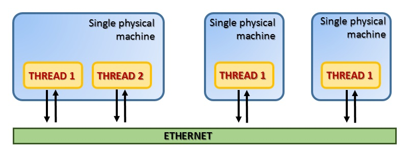
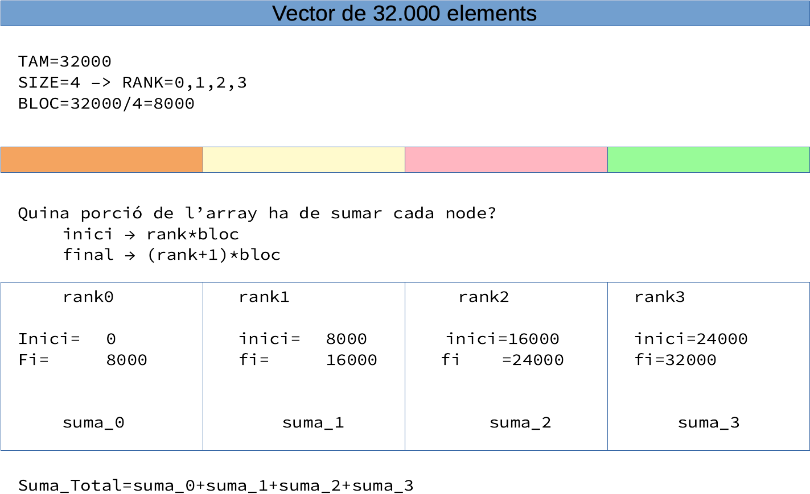
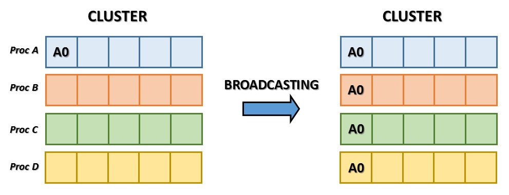
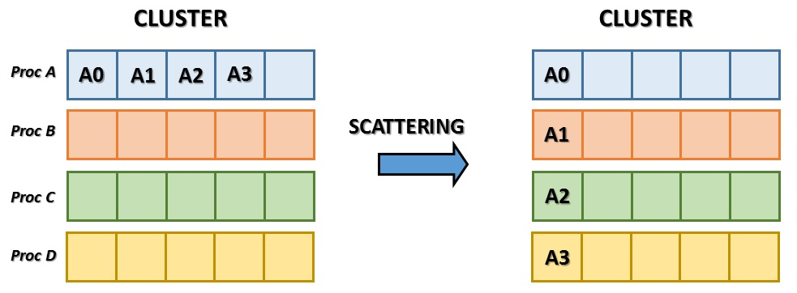
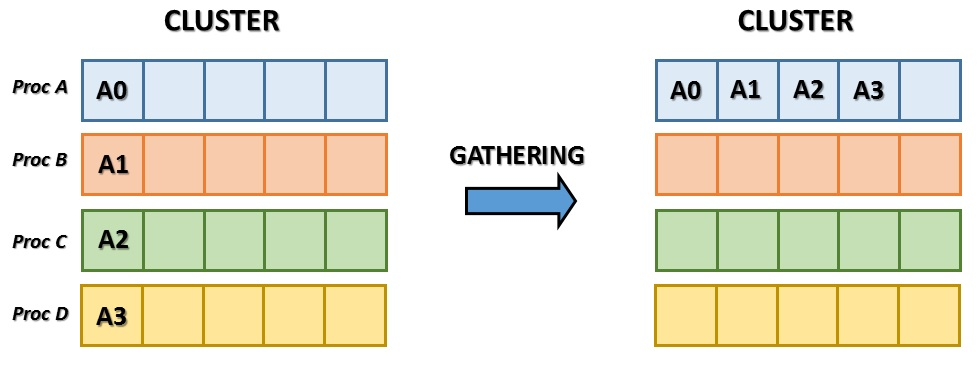
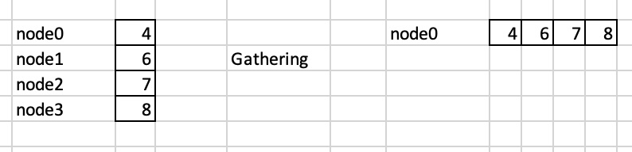
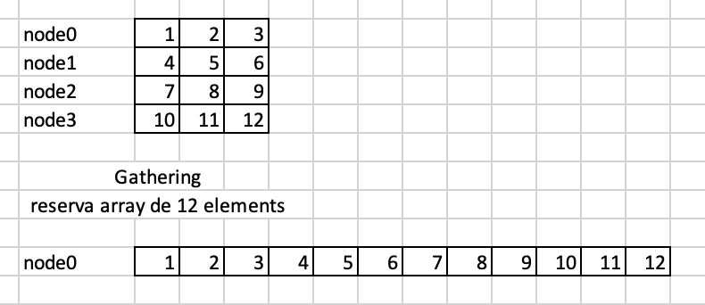
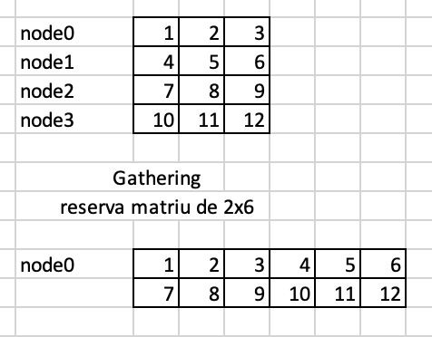
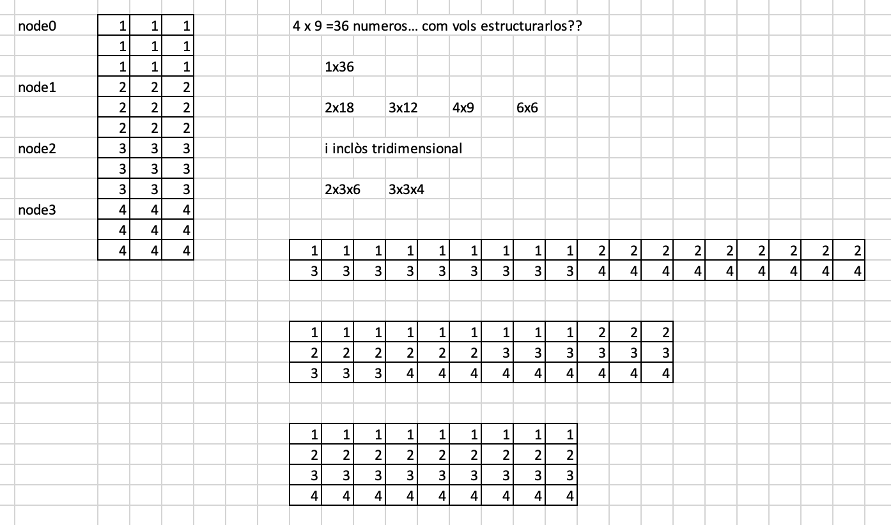
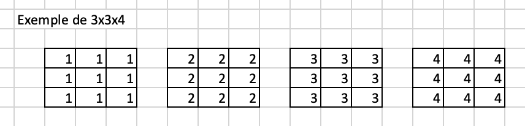

<style>
img[alt~="center"] {
  display: block;
  margin: 0 auto;
}
</style>

<!-- backgroundColor: #EBF5FB -->

# A programar...


---
# Primer programa en Python
Recordem un xicotet programa que mostra la taula de multiplicar del 4. 

> Recorda que aquest taller també és per a gent que no sap programar gaire

```python
tam=10
numero=4
for i in range(10+1):
  print ("%2d x %2d = %2d"%(i,numero,i*numero))
```
---

# El `hola món` en mpi


> Arxiu `00_helloworldmpi.py`

```python
# -*- coding: utf-8 -*-
from mpi4py import MPI
import sys

size=MPI.COMM_WORLD.Get_size()
rank=MPI.COMM_WORLD.Get_rank()
name=MPI.Get_processor_name()

print("Hello world, Soc el procés %2d de %2d al node %10s" %(rank,size,name))
```

---
# El fitxer `machinefile`

Al fitxer `machinefile` indicarem els nodes que tenim al cluster, així com el nombre de nuclis (cores), que disposa cada node. Per exemple:

```
# machinefile

node_1_1
node_1_2:4
node_1_3:2
node_1_4:4
```
Indiquem que:

- El node_1_1 sols té 1 core
- El node_1_2 i node_1_4 tenen 4 cores
- El node_1_3 té dos cores

---

# Execució
```
mpiexec -np num_processos -f machinefile python script arguments
```

on:
- S'executen `num_processos` processos, 
- el conjunt de màquines es descriu en l'arxiu `machinefile`
- `python script arguments` indica que carrega l'interpret de ___python___, executant el ___script___ amb uns ___arguments___ donats

---

# `-np num_processos`

A l'opció `-np num_processos` tenim la clau:
```
mpiexe -np 8 -f machinefile python script

size=MPI.COMM_WORLD.Get_size()
rank=MPI.COMM_WORLD.Get_rank()
name=MPI.Get_processor_name()
```

- `size`: en tots els processos valdrà 8. Tamany global.
- `rank`: en cada procés serà distint. Com hi han 8 processos, valdrà respectivament 0, 1, 2 ,... fins a 7. 
- `name`: serà el nom de la màquina on s'executa. Si alguna màquina té més d'un core, en tots aquests processos serà el mateix.

> El `rank` pot-ser siga el més important, ja que ens servirà per a identificar cadascun del processos funcionant.
---

# Com es comporten els processos

---


---


---


# Algú ha de posar ordre

Qui? 

El master, o qui coordinarà les tasques a fer. Habitualment serà aquell que `rank==0`

---

# Com es fa un programa paral·lel

```python
posem coses en comú per a tots

if rank==0:
    repartir les tasques a cadascú

rebre la tasca de root/master/cap

fer les tasques

enviar resultats a root/master/cap

if rank==0:
    resumir/presentar els resultats
```

---

# Com es comuniquen root i la resta de processos?



- Amb l'objecte `MPI.COMM_WORLD` vist anteriorment. Aquest objecte podem entendre'l com la part física de la xarxa que comunica els processos en execució
- Mitjançant enviament de missatges. Recorda que `mpi`= ___message pass interface___

---

# Exemple bàsic (1)

> Arxiu `01_basic_send_recv.py`

Volem fer un programa que li donem a cada node un nombre. Cada procés el multiplicarà pel seu `rank` i li'l tornarà al master.
```python
#                       Codi de el master
if rank==0:
  for i in range(1,size):
    data=random.randint(1, 10)
    comm.send(data,dest=i,tag=1)
  
  acabats=0
  while acabats<size:
    resposta=comm.recv(source=MPI.ANY_SOURCE,tag=1)
    proc=comm.recv(source=MPI.ANY_SOURCE,tag=2)
    print("El procés %d m'ha tornat un numero %d"%(proc,resposta))
```

---

```python
#                       Codi dels nodes
else:
  my_data=comm.recv(source=0,tag=MPI.ANY_TAG,status=status)
  tag=status.Get_tag()
  if tag==1: # datos
    x=my_data*rank
    comm.send(x,dest=0,tag=1)
    comm.send(rank,dest=0,tag=2)
```


---
# Exemple més avançat. Suma d'un vector (1)

```python
def sumar(v,inici,fi):
	sum=0
	for i in range(inici,fi):
		sum+=int(v[i])
	return sum

tamany=int(sys.argv[1])

suma=0
start=time.time()
# Creem el vector aleatori i el sumem
data = numpy.arange(tamany, dtype='i')
suma=sumar(data,0,tamany)
end=time.time()
print("La suma total es %d, calculat en %3.4f"%(suma,end-start))
```

---
# Exemple més avançat. Suma paral·lela d'un vector (2)

Tots sabem com es suma un vector. Amb un bucle for, des del primer fins a l'últim anem sumant i acumulant. 

Imaginem que tenim un vector de 32000 enters. Com podriem fer paral·lel l'algorisme de sumar un vector, si tenim per exemple 8 o 16 programes en execució?

> **Resposta**: 
> 
>  - Dividim el vector segons el nombre de processos.
>  - Cada procés suma la seua part. 
>  - Cada procés retorna la seua part de la suma al node master.
>  - El node master suma les sumes parcials i calcula el total.

---



---
# Suma de vectors (1)

Calculem els tamanys. `root` crea el vector i es fa un _broadcast_ del vector perquè tots el tinguen:

```python
tamany=int(sys.argv[1])
bloc=tamany/size

start=time.time()

if rank == 0:
   data =numpy.arange(tamany,dtype='i')
else:
   data = None # Molt important. data ha d'estar inicialitzat

data=comm.bcast(data,root=0)
```
---
# Suma de vectors (2)

Llavors deprès, TOTS el processos sumen la seua porció del vector

```python
inici=rank*bloc
final=(rank+1)*bloc
suma=0
for i in range(inici,final):
	suma+=int(data[i])
```

i retornarem les dades al `root`

---

# Suma de vectors (3)
Fixar-se que:
 - `root` rebrà les dades dels nodes i acumularà
 - els nodes sols enviaràn la seua part de la suma 
```python
if rank==0:
	total=suma #la meua suma
	for i in range(size-1):
		parcial=comm.recv(source=MPI.ANY_SOURCE,tag=1)
		total+=parcial
	
  end=time.time()
	print("La suma del vector es %d calculat en %2.5f"%(total,end-start))
else:
	comm.send(suma,dest=0,tag=1)
```

> Exemple complet al fitxer `11_suma_vector_inicial.py`
---

# Suma de vectors (i 4)

Atenció:

- Aquesta solució és bona?
- Si, no?
- Perquè creus això?


---

# Comunicacions avançades

## Broadcast (vist a l'exemple anterior)



El procés root té dades i eixes dades son rebudes per tots

---

# Broadcast  - Difussió
> Fitxer `20_mpi_broadcast.py`
```python
from mpi4py import MPI

comm = MPI.COMM_WORLD
rank = comm.Get_rank()

# El que envia té la informació
if rank == 0:
   data = 34;   #Pot-ser qualssevol tipus i valor
   # data={"nom":"Pepe","edat":43}
   # data= [3,4,5,6,7,8]
else:       # El que rep té sols la variable
    data = None

# -- Difussió --
data = comm.bcast(data, root=0)

# -- En totes el processos el mateix valor
print('Al node ' + str(rank): )
print(data)
```
---
# Scatter - Repartir (1)



Es tracta de dividir i repartir en parts iguals la tasca a processar.
Molt important la divisibilitat de les dades entre els processos a executar

---
# Scatter - Repartir(2)
> Fitxer `21_mpi_scatter.py`
```python
from mpi4py import MPI
import time

comm = MPI.COMM_WORLD
size = comm.Get_size()
rank = comm.Get_rank()

if rank == 0:
    # crea el vector [1,4,9,16] de quadrats
   data = [(i+1)**2 for i in range(size)]
else:
   data = None

# repartim les dades
data = comm.scatter(data, root=0)

# esperem una mica tots, de manera proporcional
time.sleep(rank/500)
print("Jo soc el procés %d i les meues dades son"%rank)
print(data)
```
---

# Scatter - Repartir (3)

Observar que:
 
- Les dades que dividim (variable `data`) és la entrada de la funció (està com a argument) i també com a eixida (a l'esquerre de l'igual). 
- Així aconseguim que el node master dispose també de la seua porció de dades
- el segon argument (`root=0`) indica que és el procés amb `rank==0` qui farà l'enviament d'informació, mentre que els altres sols rebran la informació.

---

# Scatter - Repartir (4)

Cas que l'objecte a transferir sigui algun objecte més complex o més gran, com un array de la llibreria `numpy` és convenient fer servir altra funció per a repartir. 

Aquesta nova manera implica fer una reserva de memòria prèvia per al vector que es rebrà al destí. Vegem l'exemple

---

# Scatter - Repartir (5)

```python
tamany=1000
bloc=tamany/size

# Al master creem un vector amb numpy. arrange el crea amb la serie 1,2,3,4,5...
if rank == 0:
   g_data =numpy.arange(tamany,dtype='i')
else:
    # als altres es cal la referència, encara que no continga res
   g_data = None

# Ara preparem el vector que contindrà la porció del gran.

# El creem buit mitjançant empty. 
l_data=numpy.empty(bloc,dtype='i')

# Fem la divisió

# dividim lo global a lo local
comm.Scatterv(g_data,l_data,root=0)

# ara tots els nodes processarien la seua part del vector, root també
```

---

# Gather - Recollida (1)

Com podreu deduir, si hem pogut fragmentar un vector en diversos més menuts, deuirem de poder reagrupar dits trossos més menuts en un global.



---

# Gather - Recollida (2)

Per a fer-ho, un cop processats les dades o vectors el més important serà:

- Reservar la memòria al `root` per a rebre tota la informació de nou
- Decidir com voldrem estructurar dita informació, ja que depenent de com creem la estructura, s'ajuntarà d'una manera o d'altra

---

# Gather - Recollida - Escalar a Vector

En aquest cas partim de que cada node (per exemple 4 nodes) té un escalar (un valor simple). Al reunir-lo el root tindrà un vector de 4 elements 



> Exemple al fitxer `30_mpi_gather.py`
```python
# En tots els nodes, creem un valor distint en cadascun 1,4,9,16,..
data = (rank+1)**2

# Enviem tots a root les nostres dades simples
data = comm.gather(data, root=0)

if rank == 0:
	print "Les dades que he rebut son ", data
```
---

# Gather -  Vector a Vector

Si en cada node tenim un vector (per exemple 4 nodes en vectors de 3 elements). Ho podem juntar tot en un gran vector (4x3=12 elements)



>Exemple en `31_mpi_gather_array.py`. 

```python
sendbuf = np.zeros(tam, dtype='i') + rank  # Un array de tam amb valors el rank del node
recvbuf = None
# Sols el node master fa reserva de memòria
if rank == 0:
	recvbuf = np.empty([size * tam], dtype='i')
```


---
# Gather - Vector a matriu

```python
sendbuf = np.zeros(tam, dtype='i') + rank  # Un array de tam a valors el rank del node

recvbuf = None

# Sols el node master fa reserva de memòria
if rank == 0:
	recvbuf = np.empty([size, tam], dtype='i')
```

## Que ha canviat??
Fixat que ha canviat les dimensións de l'estructura que reb la informació:
- `recvbuf = np.empty([size * tam], dtype='i')`
- `recvbuf = np.empty([size, tam], dtype='i')`

---

# Gather - Juguem amb els dimensions (1)

Per acabar, al reunir la informació podem jugar conforme vullguem, sempre i quan s'acomplisca la següent norma: **la quantitat de dades que s'envie serà la quantitat de dades que es col·loquen**.

Si enviem 4 vectors de 3 elements (12), podem formar una matriu de 2x6 (12)




---

# Gather - Jugant amb les dimensions (2)

Si cada node (4) té una matriu  de 3x3 (en total hi han 4x3x3=36 dades), com podem recomposar la informació?



---

# Gather - Jugant amb les dimensions (3)

Com vullguem sempre que el producte de les dimensions del resultat sigui 36, inclòs una matriu de 3x3x4 o de 4x3x3, etc



---

# Exemple. Procés d'una imatge en color


> Exemple en `40_imageFilter_Color_2_BW.py`

---

# Exemple. Càlcul de PI

<https://parzibyte.me/blog/2020/04/15/c-calculo-pi-serie-leibniz/>
