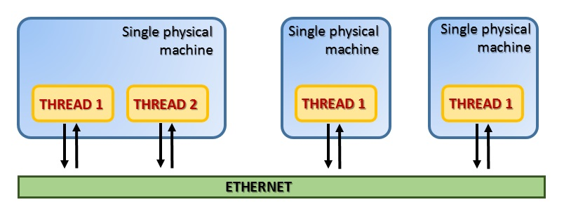
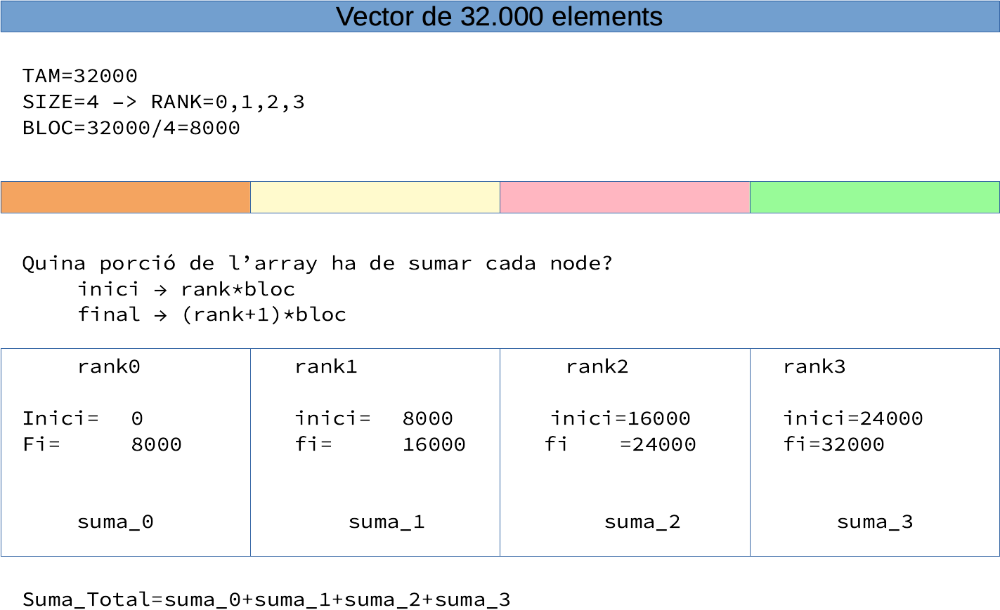
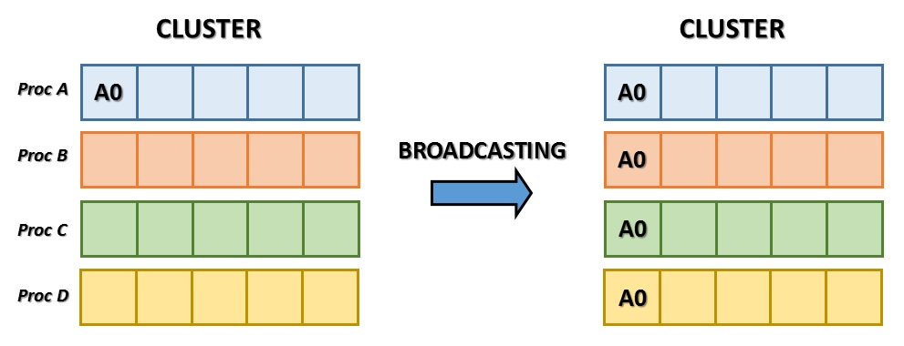
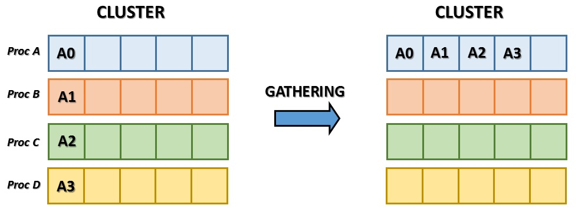
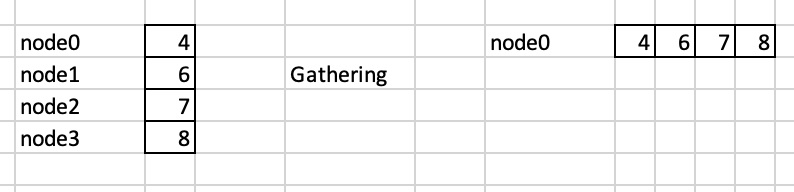
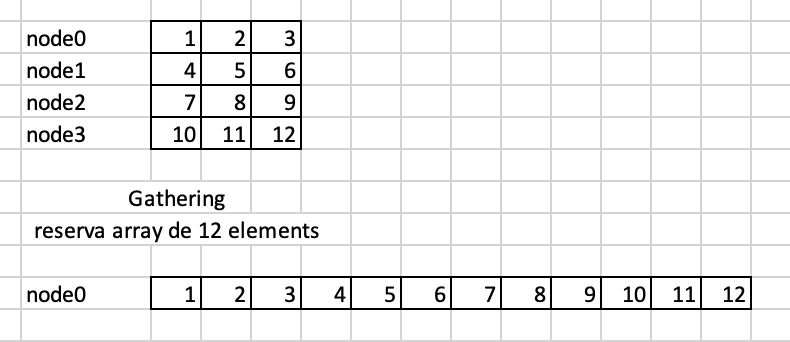
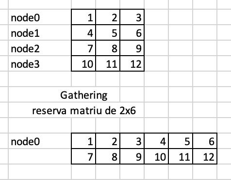
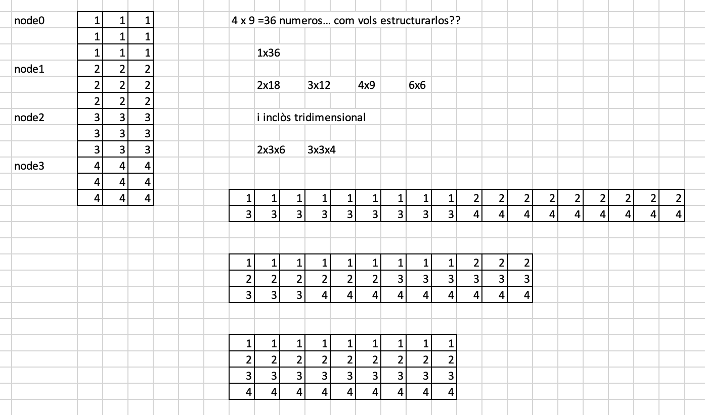
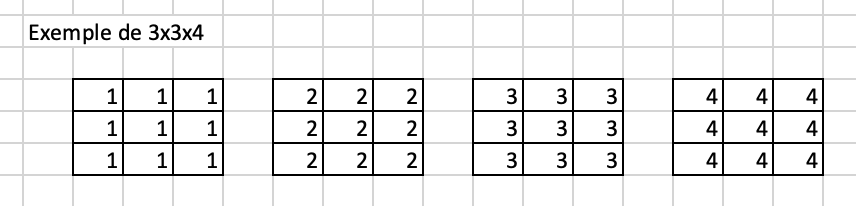

# Programació paral·lela amb mpi4py

## 1. El pas de missatges

Entre els diferents models de càlcul paral·lel, el **Pas de Missatges** va demostrar ser un dels més eficients. Aquest paradigma és especialment adequat per a arquitectures de memòria distribuïda. En aquest model, els fils es troben en una o més màquines i es comuniquen entre ells mitjançant missatges via Ethernet.



Aquest model es basa en un protocol específic anomenat **MPI** (_Message Passing Interface_). Consisteix principalment en un sistema portàtil i estandarditzat de transmissió de missatges, que actualment s’ha convertit en l’_estàndard de facto_ per a la comunicació paral·lela dins dels clústers. Des del seu primer llançament, la biblioteca estàndard MPI s'ha convertit en la més estesa.

## 1.1 Enviar i rebre objectes Python amb `Communicators`

La interfície MPI per a Python implementa el model Message Passing mitjançant el protocol MPI. Per tant, la característica clau d'aquesta interfície és la **possibilitat de enviar dades i ordres (objectes Python) entre sistemes**. Darrere d’aquesta operació s’exploten les funcionalitats especials d’un mòdul anomenat `pickle`. Aquest mòdul us permet construir representacions binàries (_pickling_) de qualsevol objecte Python (tant integrat com definit per l'usuari). Aquestes representacions binàries es poden enviar entre sistemes, de manera que es poden intercanviar dades i instruccions necessàries per al càlcul paral·lel. Les representacions binàries un cop arribades al sistema, es restauren en la seva forma original, és a dir, l'objecte Python original (_unpickling_). Tot això serà transparent al programador, que 

Aquesta opció també permet la comunicació entre sistemes heterogenis, és a dir, un clúster compost de sistemes amb diferents arquitectures. De fet, els objectes Python enviats com a representacions binàries poden ser reconstruïts pel sistema receptor d'acord amb la seva arquitectura particular.

A la biblioteca MPI, els diversos fils s’organitzen en grups anomenats **comunicadors**. Tots els fils d’un comunicador determinat poden parlar entre ells, però no amb fils externs.

L'objecte del mòdul mpi4py que implícitament realitza totes les funcions de comunicació és l'objecte `Comm`, que significa comunicador. Hi ha dues instàncies per defecte d'aquesta classe: `COMM_SELF` i `COMM_WORLD`.

A través d’ells podeu crear tots els nous comunicadors que necessiteu. De fet, quan s’activa el protocol MPI, es crea un comunicador per defecte que conté tots els fils disponibles. Per iniciar un MPI només cal importar el mòdul. A partir d'ahi, podem saber quants processos hi hauràn al clúster en aquest communicador (`comm.Get_size()`) i qui és l'actual proces (`comm.Get_size()`). Podem, ademés saber el nom del node que està executant aquest codi (`MPI.Get_processor_name()`)

```python
from mpi4py import MPI

comm = MPI.COMM_WORLD
rank = comm.Get_rank()
size = comm.Get_size()
name = MPI.Get_processor_name()
```
## 2. Execució de programes paral·lels

Quan executem un programa de manera paral·lela amb mpi, hem d'indicar 3 coses:

- Número de processos paral·lels que s'executaran
- On s'executaran dits processos.
- Programa que s'executa, amb els seus arguments, si en te.

Així per exemple:

```
mpiexec -np 8 -f machinefile python imageFilter.py Lenna.png
```

on:
- S'executen 8 processos, 
- el conjunt de màquines es descriu en l'arxiu `machinefile`, i conté linies amb el format `maquina[:cores]`
- `python imageFilter.py Lenna.png` indica que carrega l'interpret de python per a filtrar la imatge *Lenna.bmp*

Llavors hem de tenir en comte que, seguint l'anterior, s'executaran 8 programes, repartits pel cluster, tots amb el mateix codi i variables. Què és el que canvia en cada programa, si tots tenen el mateix codi, molt senzil, la variable `rank`. Si hi han 8 programes en execució, `rank = comm.Get_rank()` retornarà a cadascun els valor `0..7`, amb la qual cosa podem diferenciar entre ells 

### 2.1 _master_ i _slave_. Algorismes paral·lels

A la programació paral·lela de entre tots els programes, la filosofia serà que algú ha d'encarregar de repartir la feina, fer-la entre tots, i desprès recopilar els resultats.

El node encarregat de repartir la tasca rep el rol de `master` o `root`. Habitualment serà `root` aquell node que compleix que `rank==0`
La resta seràn els que simplement rebran la tasca a fer de `root`, la faran i li donaran resposta:

```python
if rank==0:
    repartir les tasques

rebre la tasca de root

fer les tasques

enviar resultats a root

if rank==0:
    resumir/presentar els resultats
```

> Nota: 
> 
> - Adonar-se que les tasques de repartir i rebre les dades sols les fa el màster
> - El master també és un treballador més, és a dir, posiblement també farà la seua part de tasca (o no, depenent de l'algorisme)


## 3. Tipus de comunicacions

Totes les comunicacions porten etiquetes (`tags`). Aquests proporcionen un mitjà de reconeixement per part del receptor perquè pugui entendre si ho ha de considerar o no, i de quina manera actuar.

Abans de començar a desenvolupar el codi, hem d'estudiar l'algoritme paral·lel que ens permetrà dur a terme el nostre projecte, i cal pensar quin tipus de comunicació implementar. De fet, hi ha dos tipus de comunicació: **bloquejant** i **no bloquejant**. Aquests dos tipus de comunicació difereixen segons com vulguem que es comportin els dos sistemes de comunicació.

### 3.1 La comunicació bloquejant (**Blocking**)

Generalment, les comunicacions que existeixen entre els diversos sistemes d’un clúster són bloquejants. Per tant, el programa remitent (qui envia) no continuarà mentre espere que el receptor reba la informació. Els mètodes `send()`, `recv()` i `sendrecv()` són els mètodes per comunicar objectes genèrics Python. Per permetre la transmissió de grans matrius de dades com la matriu _NumPy_  s’utilitzen mètodes com `Send()` i `Recv()` .

En aquest tipus de comunicacions, quan algun procés invoca a `recv()` es queda esperant a que algú li envie dades amb `send()`. De la mateuxa manera qui envia a `send()` es queda esperant a que el receptor ho reba amb `recv()`. Per tant per cada `send()` en algun lloc hi ha de hiaure un `recv()` en altre lloc. Sinó podem provocar situacions de bloquejos.

Per saber i classificar la informació que enviem i rebem, pot afergir-se un etiqueta o `tag` com a argument opcional, de manera que podem separar si el que hem rebut és una dada a processar o informació de control o un senyal per a acabar el programa

# Exemple: Suma d'un vector paral·lela

Tots sabem com es suma un vector. Amb un bucle for, des del primer fins a l'últim anem sumant i acumulant. 

Imaginem que tenim un vector de 32000 enters. Com podriem fer paral·lel l'algorisme de sumar un vector, si tenim per exemple 8 o 16 programes en execució?

Resposta: Dividim el vector segons el numero de processos, i cada proces suma la seua part. Cada procés retorna la seua part de la suma i el node master l'arreplega de nou.



### 3.2 Cal enviar-ho tot?

Com haurem vist a l'exemple anterior, el procediment funciona be, però el rendiment no és l'adequat. Tots els processos tenen totes les dades, i el cost d'enviar tantes dades, per molt bona que siga la xarxa, hem de millorar-lo.

Ademès, pots observar que cada procés disposa de tres quartes part de vector que no va a fer servir. Haurem doncs de donar-li **sols** la part de vector que necessita

# Exemple (2). Càlcul del numero PI (π)

## 4 Comunicacions avançades

Ja hem vist la manera bàsica de comunicar-se. Ara anem a veure maneres més eficients i optimitzades


### 4.1 Broadcast (difussió)

Mitjançant el broadcast, podem enviar una variable a la resta de processos. Requeriment: La variable ha d'existir prèviament en tots el processos, en el que envia, òbviament amb el valor que volem difondre i en els que rebràn la informació amb valor `None` (null).



Exemple:

```python
from mpi4py import MPI

comm = MPI.COMM_WORLD
rank = comm.Get_rank()


if rank == 0:
    # El que envia té la informació
   data = 34;   #Pot-ser qualssevol tipus i valor
   # data={"nom":"Pepe","edat":43}
   # data= [3,4,5,6,7,8]
else:
    # El que rep te sols la variable
    data = None

# -- Difussió --
data = comm.bcast(data, root=0)

# -- En totes el processos el mateix valor
print('Al node ' + str(rank): )
print(data)
```

### 4.2 Scatter (fragmentar-dispersar-dividir)

Com hem vist a l'exemple de la suma dels vectors, el rendiment no era gaire adequat. Això és perquè tots els processos tenien tota la informació, i enviar la informació d'un node a altre te un cost (temporal)

Com hem comentat la solució és repartir a cada node sols la part de vector que necessita, i això podem aconseguir-ho amb `scatter`

Amb el mecanisme de dispersió (**scattering**) el node que ho executa s'encarrega de dividir la informació, que obligatòriament haura de ser una llista (vector) i enviar-la a cadascun dels nodes que conformen el clúster


Habitualment intentar que el tamany de la llista siga divisible pel número de nodes del clúster, així tots treballen amb la mateixa quantitat d'informació.

```python
from mpi4py import MPI

comm = MPI.COMM_WORLD
size = comm.Get_size()
rank = comm.Get_rank()

if rank == 0:
    # crea el vector [1,4,9,16]
   data = [(i+1)**2 for i in range(size)]
else:
   data = None

data = comm.scatter(data, root=0)
print ("Soc el proces %d i he rebut: "%rank)
print (data)
```
> Observar que:
> 
> - La data que dividim és la entrada de la funció (està com a argument) i també com a eixida (a l'esquerre de l'igual). Així aconseguim que el node master dispose també de la seua porció de dades
> - el segon argument (`root=0`) indica que és el procés amb `rank==0` qui farà l'enviament d'informació, mentre que els altres sols rebran la informació.

Cas que l'objecte a transferir sigui algun objecte més complex o més gran, com un array de la llibreria `numpy` és convenient fer servir altra funció per a repartir. 

Aquesta nova manera implica fer una reserva de memòria prèvia per al vector que es rebrà al destí. Vegem l'exemple:

```python
from mpi4py import MPI
import numpy

comm = MPI.COMM_WORLD
size = comm.Get_size()
rank = comm.Get_rank()


tamany=1000
bloc=tamany/size

# Al master creem un vector amb numpy.
# arrange el crea amb la serie 1,2,3,4,5...
if rank == 0:
   g_data =numpy.arange(tamany,dtype='i')
else:
    # als altres es cal la referència, 
    # encara que no continga res
   g_data = None

# Ara preparem el vector que contindrà la porció del gran. 
# El creem buit mitjançant empty. 
l_data=numpy.empty(bloc,dtype='i')

# Fem la divisió

# dividim lo global a lo local
comm.Scatterv(g_data,l_data,root=0)

# ara tots els nodes processarien la seua part del vector, 
# root també
```

### 4.3 Gather (reunir)

Com podreu deduir, si hem pogut fragmentar un vector en diversos més menuts, deuirem de poder reajuntar dits trossos més menuts en un global.



Per a fer-ho, un cop processats les dades o vectors el més important serà:

- reservar la memòria al root per a rebre tota la informació
- Decidir com voldrem estructurar dita informació, ja que depenent de com creem la estrcutura, s'ajuntarà d'una manera o d'altra

#### 4.3.1 Escalar a vector

En aquest cas partim de que cada node (per exemple 4) te un escalar (un valor simple). Al reunir-lo el root tindrà un vector de 4 elements 



#### 4.3.2 Vector a vector

Si en cada node tenim un vector (per exemple 4 nodes en vectors de 3 elements). Ho podem juntar tot en un gran vector (4x3=12 elements)



#### 4.3.2 Jugant en les dimensions

Per acabar, al reunir la informació podem jugar conforme vullguem, sempre i quant s'acomplisca la següent norma: **la quantitat de dades que s'envie serà la quantitat de dades que es coloquen**.

Si enviem 4 vectors de 3 elements (12), podem formar una matriu de 2x6 (12)




Si cada node (4) te una matriu  de 3x3 (en total hi han 4x3x3=36 dades), com podem recomposar la informació?



Con vullguem sempre que el producte de les dimensions del resultat sigui 36, inclòs una matriu de 3x3x4 o de 4x3x3, etc



# Exemple (3). Filtratge d'una imatge en color


